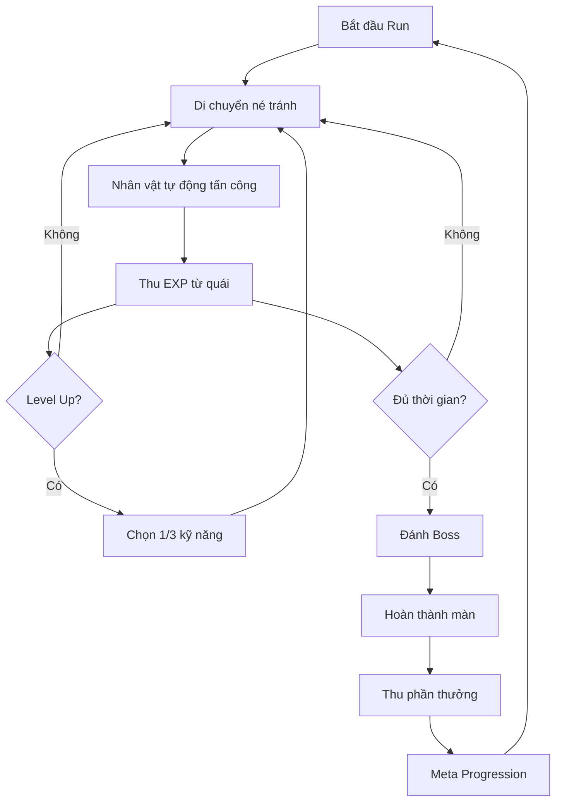
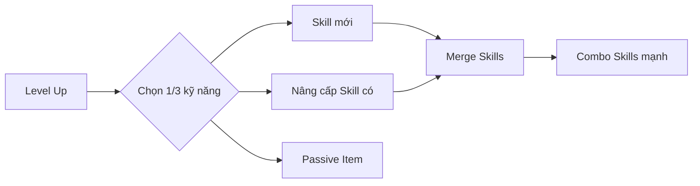
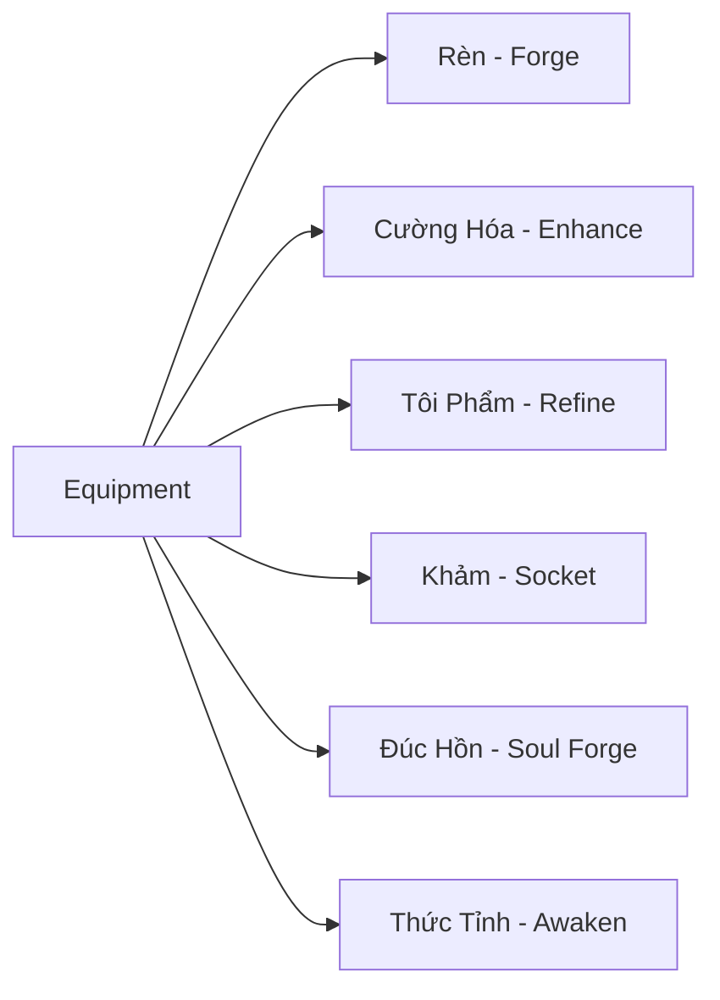
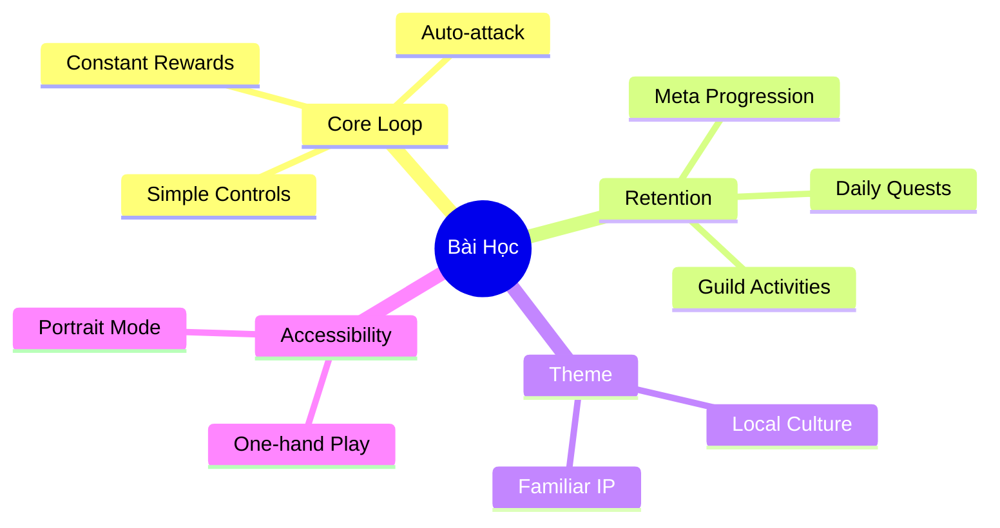

# 🎮 Phân Tích Hệ Thống Game: Đại Hiệp Chạy Đi

> **Thể loại:** Roguelike Auto-Battler (Vampire Survivors-like)
> **Nhà phát triển:** MGOL SOFTWARE CO.,LTD
> **Ngày ra mắt:** 12/10/2023
> **Rating:** 3.9/5 ⭐ (6.9K đánh giá trên App Store)
> **Tên quốc tế:** Survivor Master-Sifu

---

## 📋 Mục Lục
1. [Tổng Quan Game](#tổng-quan-game)
2. [Core Gameplay Loop](#core-gameplay-loop)
3. [Hệ Thống Combat](#hệ-thống-combat)
4. [Hệ Thống Skill & Progression](#hệ-thống-skill--progression)
5. [Hệ Thống Equipment](#hệ-thống-equipment)
6. [Hệ Thống Monetization](#hệ-thống-monetization)
7. [So Sánh với Vampire Survivors](#so-sánh-với-vampire-survivors)
8. [Điểm Mạnh & Điểm Yếu](#điểm-mạnh--điểm-yếu)
9. [Bài Học Thiết Kế](#bài-học-thiết-kế)

---

## Tổng Quan Game

**Đại Hiệp Chạy Đi** là một tựa game nhập vai hành động roguelike với chủ đề **kiếm hiệp/võ lâm** (Kim Dung style). Game thuộc thể loại "Survivors-like" - lấy cảm hứng từ hit game **Vampire Survivors**.

### Cốt Truyện
Người chơi vào vai một **hiệp khách vô danh** mang trong mình bí kíp võ công tổ truyền. Nhân vật muốn rời xa tranh chấp giang hồ để phiêu bạt khắp nơi, nhưng liên tục bị cuốn vào các trận chiến với quái vật và trùm.

### Đặc Điểm Chính
| Đặc điểm | Mô tả |
|----------|-------|
| **Màn hình** | Dọc (Portrait mode) |
| **Điều khiển** | Một tay - chỉ di chuyển |
| **Combat** | Tự động tấn công |
| **Chế độ** | PvE + PvP + Co-op |
| **Dung lượng** | 1.5 GB |
| **iOS yêu cầu** | 10.0+ |

---

## Core Gameplay Loop



### Vòng Lặp Cốt Lõi
1. **Start Run:** Bắt đầu một lượt chơi mới
2. **Survive:** Di chuyển né tránh vô số kẻ địch
3. **Auto-Attack:** Nhân vật tự động sử dụng vũ khí/kỹ năng
4. **Collect XP:** Thu thập kinh nghiệm từ quái chết
5. **Level Up:** Chọn 1 trong 3 kỹ năng/nâng cấp ngẫu nhiên
6. **Beat Boss:** Đánh bại boss để hoàn thành màn
7. **Meta-Progress:** Sử dụng phần thưởng để nâng cấp vĩnh viễn

---

## Hệ Thống Combat

### Triết Lý Thiết Kế
Game áp dụng mô hình **"Reverse Bullet Hell"** - thay vì bạn bắn địch, bạn chỉ lo **né tránh** trong khi vũ khí tự động tấn công.

### Điều Khiển
```
┌─────────────────────────────────┐
│                                 │
│     ← Di chuyển →               │
│        ↑                        │
│        │                        │
│        ↓                        │
│                                 │
│  [Joystick ảo một ngón]         │
│                                 │
└─────────────────────────────────┘
```

### Loại Vũ Khí

| Vũ khí | Đặc điểm | Play-style |
|--------|----------|------------|
| **Kiếm (Sword)** | Cận chiến, sát thương cao | Aggressive |
| **Quạt (Fan)** | Tầm trung, AoE | Balanced |
| **Nỏ (Crossbow)** | Tầm xa, xuyên thấu | Safe |
| **Tiêu (Dart)** | Multi-hit, linh hoạt | Technical |

### Cơ Chế War

- **Auto-targeting:** Nhân vật tự động nhắm mục tiêu gần nhất
- **Cooldown-based:** Mỗi skill có thời gian hồi riêng
- **Crowd Control:** Đối mặt với hàng trăm quái cùng lúc
- **Boss Fights:** Có dodge patterns cần nhận biết

---

## Hệ Thống Skill & Progression

### Môn Phái System
Game tự hào có **100+ môn phái bí kíp** võ công khác nhau, mỗi môn phái có bộ skill riêng.



### Tiến Trình Võ Công

| Hoạt động | Mô tả | Phần thưởng |
|-----------|-------|-------------|
| **Luyện Công** | Tu luyện võ công | Tăng stats |
| **Độ Kiếp** | Vượt qua thử thách | Unlock tầng mới |
| **Nhiệm Vụ Giang Hồ** | Daily/Weekly quests | Điểm cống hiến |
| **Đại Đệ Tử** | Đệ tử học skill từ các phái | Skill mới |

### Skill Merge System
Một trong những mechanics thú vị nhất - **kết hợp các võ công** để tạo combo siêu mạnh:

```
Skill A (Lv.Max) + Skill B (Lv.Max) = Ultimate Skill
```

Ví dụ:
- **Độc Cô Cửu Kiếm** + **Lăng Ba Vi Bộ** = ???
- Người chơi phải khám phá các combo ẩn

---

## Hệ Thống Equipment

### Equipment Slots (6 ô)

```
        ┌─────────┐
        │ Weapon  │
        └─────────┘
   ┌─────┐     ┌─────┐
   │Armor│     │ Ring│
   └─────┘     └─────┘
   ┌─────┐     ┌─────┐
   │Boots│     │Amulet│
   └─────┘     └─────┘
        ┌─────────┐
        │Accessory│
        └─────────┘
```

### Stats Equipment

| Stat | Ký hiệu | Mô tả |
|------|---------|-------|
| Attack | ATK | Sát thương |
| Defense | DEF | Giảm damage nhận |
| HP | HP | Máu tối đa |
| Lifesteal | LS | Hút máu |
| Heal | HEAL | Hồi máu |
| Damage Reduction | DR | Giảm % damage |
| Cooldown Reduction | CDR | Giảm thời gian hồi |

### Rarity Tiers

```
Common (Trắng) → Uncommon (Xanh lá) → Rare (Xanh dương) → Epic (Tím) → Legendary (Cam)
```

### Set Effects
Mặc đủ bộ trang bị cùng set sẽ kích hoạt hiệu ứng đặc biệt:

| Set | Bonus 2 mảnh | Bonus 4 mảnh |
|-----|--------------|--------------|
| **Kim Thiện** | +15% ATK | +30% HP, +10% Dodge |
| **Vô Song** | +20% Crit Rate | +50% Crit Damage |

### Hệ Thống Upgrade Equipment



---

## Hệ Thống Monetization

### Mô Hình F2P với IAP

Game áp dụng mô hình **Free-to-Play** với nhiều cơ chế monetization:

### 1. Gacha/Loot Box
```
┌─────────────────────────────────┐
│         TREASURE CHEST          │
│  ┌───┐ ┌───┐ ┌───┐ ┌───┐ ┌───┐  │
│  │ ? │ │ ? │ │ ? │ │ ? │ │ ? │  │
│  └───┘ └───┘ └───┘ └───┘ └───┘  │
│                                 │
│  [Mở ngay] - Gems               │
│  [Xem quảng cáo] - Free         │
└─────────────────────────────────┘
```

- Rương thu thập vũ khí Tier 5
- Người chơi được khuyên "reroll" đầu game để có equipment hiếm

### 2. Code Tân Thủ
- Mã code cho người chơi mới
- Cung cấp tài nguyên ban đầu

### 3. Chợ (Market)
- Mua/bán item
- Flash sales

### 4. Bang Hội (Guild)
- Unlock combat buffs
- Phần thưởng từ hoạt động nhóm

### 5. VIP System (Dự đoán)
- Các tier VIP dựa trên số tiền nạp

> [!WARNING]
> **Phản hồi từ người chơi:** Nhiều đánh giá tiêu cực về "lừa đảo, hút máu, kích nạp, bóp vật phẩm" và "càng nạp càng bị bóp" - dấu hiệu của **aggressive monetization**.

---

## So Sánh với Vampire Survivors

| Aspect | Vampire Survivors | Đại Hiệp Chạy Đi |
|--------|-------------------|------------------|
| **Theme** | Gothic Horror | Kiếm Hiệp VN |
| **Màn hình** | Landscape | Portrait |
| **Giá** | Paid ($5) | F2P + IAP |
| **Meta-prog** | Vừa phải | Nặng |
| **P2W** | Không | Có dấu hiệu |
| **Skill System** | Evolutions | Môn phái + Merge |
| **Graphics** | Pixel Art | 2D Cartoon |
| **Social** | Không | PvP + Guild |

### Điểm Khác Biệt Chính

1. **Portrait Mode:** Tối ưu cho mobile một tay
2. **Kiếm Hiệp Theme:** Phù hợp thị trường VN
3. **Guild System:** Thêm yếu tố social
4. **Deep Equipment:** Hệ thống equipment phức tạp hơn
5. **PvP Mode:** Cạnh tranh với người chơi khác

---

## Điểm Mạnh & Điểm Yếu

### ✅ Điểm Mạnh

1. **Accessibility:** Điều khiển một tay, dễ chơi
2. **Theme hấp dẫn:** Kiếm hiệp quen thuộc với người Việt
3. **Addictive Loop:** "Just one more run" hiệu quả
4. **Content dồi dào:** 100+ môn phái, nhiều vũ khí
5. **Social Features:** Co-op và PvP tăng tương tác
6. **Quick Sessions:** Phù hợp chơi ngắn

### ❌ Điểm Yếu

1. **Pay-to-Win:** Gacha ảnh hưởng lớn đến tiến bộ
2. **Aggressive Monetization:** "Bóp" người chơi
3. **Complexity Creep:** Quá nhiều hệ thống upgrade
4. **Reroll Meta:** Khuyến khích reset account
5. **Balance Issues:** Người nạp mạnh áp đảo PvP

---

## Bài Học Thiết Kế

### 🎯 Những Gì Nên Học



### 📝 Áp Dụng Cho Project

1. **Core Mechanic:** Movement-only control rất hiệu quả cho mobile
2. **Progression:** Cần cân bằng giữa per-run và meta progression
3. **Monetization:** Tránh aggressive P2W - ảnh hưởng rating
4. **Theme:** Sử dụng văn hóa địa phương là lợi thế
5. **Skill Merge:** Hệ thống kết hợp skill tạo depth

### ⚠️ Những Gì Nên Tránh

| Anti-pattern | Hậu quả | Giải pháp |
|--------------|---------|-----------|
| Aggressive Gacha | Rating thấp | Cosmetic-only gacha |
| Reroll Meta | Bad onboarding | Guaranteed good start |
| P2W PvP | Toxicity | Separate brackets |
| Too many systems | Overwhelming | Gradual unlock |

---

## Kết Luận

**Đại Hiệp Chạy Đi** là một adaptation thành công của formula Vampire Survivors cho thị trường mobile Việt Nam, với theme kiếm hiệp quen thuộc và lối chơi phù hợp.

Tuy nhiên, game chịu chỉ trích nặng về **monetization aggressive**, điều này ảnh hưởng đến rating và long-term retention.

**Đánh giá tổng quan:**

| Tiêu chí | Điểm | Ghi chú |
|----------|------|---------|
| Gameplay | 8/10 | Simple nhưng addictive |
| Content | 7/10 | Nhiều nhưng repetitive |
| Monetization | 4/10 | Quá aggressive |
| Theme | 9/10 | Fit perfect cho VN |
| **Overall** | **7/10** | Good game, bad business model |

---

*Phân tích được thực hiện ngày: 12/12/2024*
