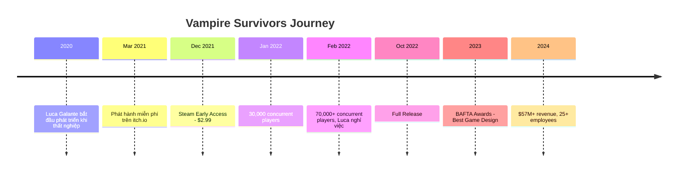
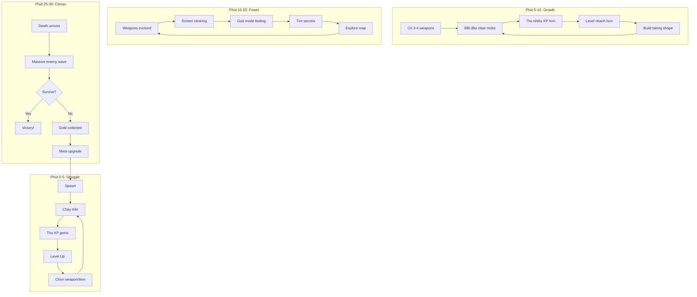
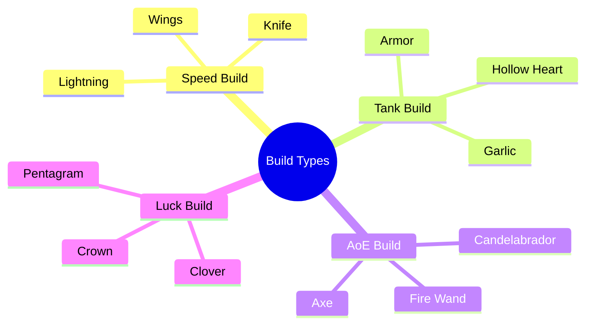

# 🧛 Phân Tích Hệ Thống Game: Vampire Survivors

> **Thể loại:** Roguelike Auto-Battler / Bullet Heaven
> **Nhà phát triển:** poncle (Luca Galante)
> **Ngày ra mắt:** 17/12/2021 (Early Access) → 20/10/2022 (Full)
> **Giá:** $4.99 (+ DLC)
> **Rating:** 98.4% Positive trên Steam
> **Doanh thu ước tính:** $57M+

---

## 📋 Mục Lục
1. [Câu Chuyện Thành Công](#câu-chuyện-thành-công)
2. [Core Gameplay Loop](#core-gameplay-loop)
3. [Hệ Thống Vũ Khí & Evolution](#hệ-thống-vũ-khí--evolution)
4. [Hệ Thống Passive Items](#hệ-thống-passive-items)
5. [Meta Progression](#meta-progression)
6. [Content: Characters, Stages, Arcanas](#content-characters-stages-arcanas)
7. [Monetization Philosophy](#monetization-philosophy)
8. [So Sánh với Đại Hiệp Chạy Đi](#so-sánh-với-đại-hiệp-chạy-đi)
9. [Bài Học Thiết Kế](#bài-học-thiết-kế)

---

## Câu Chuyện Thành Công

### Timeline Phát Triển



### Đầu Tư Ban Đầu

| Hạng mục | Chi phí |
|----------|---------|
| Asset mua sẵn | ~£500 |
| Âm nhạc | ~£300 |
| Art bổ sung | ~£300 |
| **Tổng cộng** | **~£1,100** (~$1,400) |

### Thành Tích

| Metric | Con số |
|--------|--------|
| Steam copies | 6M+ |
| Steam revenue | ~$20M |
| Total gross revenue | $57M+ |
| Net revenue (dev) | $16M+ |
| Steam rating | 98.4% positive |
| Awards | BAFTA Best Game Design, Golden Joystick |

> [!NOTE]
> **ROI đáng kinh ngạc:** Đầu tư $1,400 → Thu về $57,000,000+ = **40,000x return**

---

## Core Gameplay Loop

### The Spiral Loop

Không giống loop tuyến tính, Vampire Survivors sử dụng **Core Gameplay Spiral** - mỗi vòng lặp cảm giác khác nhau:



### Mechanics Cốt Lõi

| Mechanic | Mô tả | Tại sao hiệu quả |
|----------|-------|------------------|
| **Movement Only** | Chỉ điều khiển di chuyển | Low barrier, focus on strategy |
| **Auto-Attack** | Vũ khí tự bắn theo cooldown | Feel powerful without effort |
| **XP Gems** | Quái drop gems, hút về nhân vật | Satisfying collection |
| **Level Choice** | Chọn 1/3-4 options | Meaningful micro-decisions |
| **30-min Session** | Giới hạn thời gian rõ ràng | Perfect session length |
| **Boss Timer** | Boss xuất hiện theo thời gian | Milestone markers |

---

## Hệ Thống Vũ Khí & Evolution

### Weapon Slots
- Tối đa **6 vũ khí** active
- Mỗi vũ khí upgrade tối đa **Level 8**

### Passive Item Slots
- Tối đa **6 passive items**
- Mỗi item có **5 levels**

### Evolution System ⭐

Đây là **killer feature** của Vampire Survivors:

```
Weapon (Lv.8) + Passive Item = EVOLVED WEAPON
```

**Điều kiện Evolution:**
1. Weapon đạt level max (8)
2. Có passive item tương ứng
3. Mở chest từ boss (sau phút 10)

### Bảng Evolution Chính

| Weapon | + Passive | = Evolved Weapon |
|--------|-----------|------------------|
| Whip | Hollow Heart | **Bloody Tear** (lifesteal) |
| Magic Wand | Empty Tome | **Holy Wand** (no cooldown) |
| Knife | Bracer | **Thousand Edge** (barrage) |
| Axe | Candelabrador | **Death Spiral** (huge AoE) |
| Cross | Clover | **Heaven Sword** (homing) |
| King Bible | Spellbinder | **Unholy Vespers** (permanent) |
| Fire Wand | Spinach | **Hellfire** (explosions) |
| Garlic | Pummarola | **Soul Eater** (steal HP) |
| Santa Water | Attractorb | **La Borra** (damage zones) |
| Lightning Ring | Duplicator | **Thunder Loop** (chain) |
| Pentagram | Crown | **Gorgeous Moon** (screen clear) |
| Peachone + Ebony Wings | - | **Vandalier** (union) |

> [!TIP]
> **Design Insight:** Evolution system tạo ra puzzle layer - người chơi phải plan build từ đầu run

---

## Hệ Thống Passive Items

### Stat Boosters

| Item | Effect | Synergy với |
|------|--------|-------------|
| **Spinach** | +10% Might | Damage dealers |
| **Armor** | +1 Armor | Tanky builds |
| **Hollow Heart** | +20% Max HP | Survival |
| **Pummarola** | +0.2 HP/s regen | Sustain |
| **Empty Tome** | -8% Cooldown | Spam builds |
| **Candelabrador** | +10% Area | AoE weapons |
| **Bracer** | +10% Projectile Speed | Ranged |
| **Spellbinder** | +10% Duration | Lingering effects |
| **Duplicator** | +1 Projectile | Quantity over quality |
| **Wings** | +10% Move Speed | Kiting |
| **Attractorb** | +50% Pickup radius | QoL |
| **Clover** | +10% Luck | Crit & drops |
| **Crown** | +8% XP gain | Faster scaling |
| **Stone Mask** | +10% Coin gain | Meta farming |
| **Tiramisu** | Revival | Second chance |

### Strategic Depth



---

## Meta Progression

### Gold System

```
Run → Collect Gold → Spend on PowerUps → Become Stronger → Better Runs
```

### PowerUp Shop

| PowerUp | Max Level | Effect per Level |
|---------|-----------|------------------|
| Might | 5 | +5% damage |
| Armor | 3 | +1 armor |
| Max Health | 3 | +10% HP |
| Recovery | 5 | +0.1 HP/s |
| Cooldown | 2 | -2.5% cooldown |
| Area | 2 | +5% area |
| Speed | 2 | +5% projectile speed |
| Duration | 2 | +7.5% duration |
| Amount | 1 | +1 projectile |
| MoveSpeed | 2 | +5% move speed |
| Magnet | 2 | +25% pickup radius |
| Luck | 3 | +10% luck |
| Growth | 5 | +3% XP |
| Greed | 5 | +10% gold |
| Curse | 5 | +10% enemy speed/HP/spawn (risk/reward!) |
| Revival | 3 | +1 revive |
| Reroll | 5 | +1 reroll per run |
| Skip | 5 | +1 skip per run |
| Banish | 5 | +1 banish per run |

> [!IMPORTANT]
> **Curse** là mechanic thiên tài - tăng difficulty để unlock content nhanh hơn

---

## Content: Characters, Stages, Arcanas

### Characters (50+)

Mỗi character có:
- Starting weapon độc đáo
- Passive bonus riêng
- Unlock condition khác nhau

**Ví dụ characters:**

| Character | Starting Weapon | Passive |
|-----------|-----------------|---------|
| Antonio | Whip | +10% damage, +5% per level |
| Imelda | Magic Wand | +10% XP, +5% per level |
| Pasqualina | Runetracer | +10% projectile speed |
| Gennaro | Knife | +1 projectile |
| Arca | Fire Wand | -15% cooldown |
| Porta | Lightning Ring | +30% area |
| Poe | Garlic | +25% pickup, -30% max HP |
| Mortaccio | Bone | +1 projectile per 20 levels |
| Lama Ladonna | Axe | +10% might, speed, duration, area |
| **Red Death** | Death Spiral (maxed) | +100% move speed |

### Stages (15+)

| Stage | Theme | Special Feature |
|-------|-------|-----------------|
| Mad Forest | Forest | Default, balanced |
| Inlaid Library | Bookcases | Narrow corridors |
| Dairy Plant | Industrial | Long horizontal |
| Gallo Tower | Castle | Vertical scrolling |
| Cappella Magna | Church | Secret boss |
| Il Molise | Countryside | Joke stage (empty) |
| Moongolow | moonlight | All weapons appear |
| Holy Forbidden | Endgame | Ultimate challenge |
| Tiny Bridge | Bridge | Smallest map |
| Boss Rash | Boss Rush | Continuous bosses |

Mỗi stage có:
- **Normal Mode**
- **Hyper Mode** (faster everything)
- **Hurry Mode** (2x spawn rate)

### Arcanas (22)

Arcanas = Game modifiers unlocked by achievements

| Arcana | Effect |
|--------|--------|
| I - Game Killer | AoE +100%, Projectiles become AoE |
| II - Twilight Requiem | -50% Cooldown, +50% Might |
| IV - Awake | Revive with +30% MaxHP |
| VII - Iron Blue Will | Retaliator evolves automatically |
| X - Beginning | +3 items at start |
| XVI - Slash | +50% Crit Damage |
| XIX - Heart of Fire | Fire damage heals |
| XXI - Blood Astronomia | Might +5% per curse level |

---

## Monetization Philosophy

### Pricing Strategy

| Product | Price | Content |
|---------|-------|---------|
| Base Game | $4.99 | 50+ hours content |
| Legacy of the Moonspell DLC | $1.99 | 8 characters, 1 stage, weapons |
| Tides of the Foscari DLC | $1.99 | 8 characters, 1 stage, weapons |
| Emergency Meeting DLC | $1.99 | Among Us crossover |
| Operation Guns DLC | $1.99 | Contra crossover |
| Ode to Castlevania DLC | $2.99 | Castlevania crossover |

### Triết Lý Poncle

```
"Chúng tôi làm game để chơi, không phải để móc túi người chơi"
                                        - Luca Galante
```

**Nguyên tắc:**
1. ❌ Không Free-to-Play với IAP
2. ❌ Không Gacha
3. ❌ Không Pay-to-Win
4. ❌ Không Web3/NFT
5. ❌ Không AI-generated content
6. ✅ Giá thấp, content cao
7. ✅ DLC là lựa chọn, không bắt buộc
8. ✅ Tôn trọng thời gian người chơi

> [!IMPORTANT]
> **Poncle Presents** - nhánh publishing mới của poncle, giúp indie devs khác publish game với triết lý tương tự

---

## So Sánh với Đại Hiệp Chạy Đi

| Aspect | Vampire Survivors | Đại Hiệp Chạy Đi |
|--------|-------------------|------------------|
| **Price** | $4.99 (one-time) | Free + aggressive IAP |
| **Monetization** | Ethical | Gacha, P2W |
| **Rating** | 98.4% positive | 3.9/5 (mixed) |
| **Session length** | 30 mins fixed | Variable |
| **Evolution system** | Weapon + Passive | Skill merge |
| **Screen** | Landscape | Portrait |
| **Control** | 4-direction | Joystick |
| **Theme** | Horror/Gothic | Kiếm hiệp |
| **Complexity** | Simple, elegant | Complex, layered |
| **Equipment** | None | 6 slots + upgrades |
| **Social** | None | Guild, PvP |

### Điểm Vampire Survivors Làm Tốt Hơn

1. **Purity of design** - Không feature creep
2. **Fair monetization** - Trả 1 lần, chơi mãi mãi
3. **Community goodwill** - 98% positive reviews
4. **Evolution puzzle** - Chiều sâu không qua complexity

### Điểm Đại Hiệp Chạy Đi Làm Tốt Hơn

1. **Mobile optimization** - Portrait, one-hand
2. **Local theme** - Kiếm hiệp phù hợp VN
3. **Social features** - Guild, co-op, PvP
4. **Variety** - Nhiều equipment options

---

## Bài Học Thiết Kế

### 🎯 10 Nguyên Tắc Vàng Từ Vampire Survivors

```
                            🎮 DESIGN PRINCIPLES
                                    │
        ┌───────────┬───────────┬───┴───┬───────────┬───────────┐
        │           │           │       │           │           │
   ┌────┴────┐ ┌────┴────┐ ┌────┴────┐ ┌┴─────────┐ ┌┴─────────┐
   │ 1.SIMPLE│ │ 2.DEPTH │ │3.PROGRESS│ │4.FAIRNESS│ │5.SESSION │
   └────┬────┘ └────┬────┘ └────┬────┘ └────┬─────┘ └────┬─────┘
        │           │           │           │            │
   ▪ One input  ▪ Build     ▪ Per-run   ▪ No P2W    ▪ 30 min
   ▪ Clear        variety     growth    ▪ Skill       perfect
     goals      ▪ Evolution ▪ Meta        matters   ▪ Always
                  puzzle      unlocks                 progress
        
        ┌───────────┬───────────┬───────────┬───────────┐
        │           │           │           │           │
   ┌────┴────┐ ┌────┴────┐ ┌────┴────┐ ┌────┴────┐ ┌────┴────┐
   │6.DISCOVER│ │7.VARIETY│ │8.POLISH │ │9.PRICING│ │10.RESPECT│
   └────┬────┘ └────┬────┘ └────┬────┘ └────┬────┘ └────┬────┘
        │           │           │           │           │
   ▪ Secret     ▪ 50+       ▪ Juice    ▪ High     ▪ Time
     characters   characters ▪ Game       value   ▪ Money
   ▪ Hidden     ▪ Many        feel     ▪ Low
     stages       builds                 price
```

### Áp Dụng Cho Project

| Principle | Làm thế nào |
|-----------|-------------|
| **Simplicity** | 1-2 inputs max cho core gameplay |
| **Depth** | Tạo synergy systems (không phải raw complexity) |
| **Evolution** | Cho người chơi "discover" combinations |
| **Fair Meta** | Permanent unlocks, không daily timers |
| **Session** | Fixed time hoặc clear milestones |
| **Secrets** | Hidden content để khám phá |
| **Pricing** | Nếu F2P, cosmetics only |

### ⚠️ Trade-offs Cần Cân Nhắc

| VS Approach | Trade-off |
|-------------|-----------|
| Paid upfront | Ít users nhưng quality users |
| No equipment | Less customization |
| No social | No viral loop |
| Fixed session | Không flexible |
| Simple graphics | Có thể bị đánh giá "cheap" |

---

## Kết Luận

**Vampire Survivors** là case study hoàn hảo về:

1. ✅ **Ít hơn là nhiều hơn** - Đơn giản nhưng addictive
2. ✅ **Tôn trọng người chơi** - Không khai thác psychology tiêu cực
3. ✅ **Quality over quantity** - Content có chiều sâu
4. ✅ **Fair business** - Giá thấp, giá trị cao
5. ✅ **Indie spirit** - 1 người làm, triệu người chơi

### Đánh Giá Tổng Quan

| Tiêu chí | Điểm | Ghi chú |
|----------|------|---------|
| Gameplay | 10/10 | Hoàn hảo cho thể loại |
| Content | 9/10 | Dồi dào, có chiều sâu |
| Monetization | 10/10 | Industry gold standard |
| Polish | 8/10 | Pixel art đơn giản nhưng hiệu quả |
| Replayability | 10/10 | Hundreds of hours |
| **Overall** | **9.5/10** | Near-perfect game design |

---

*Phân tích được thực hiện ngày: 12/12/2024*
*Tham khảo: [Game_Analysis.md](file:///f:/Antigravity%20Project/Game/%C4%90%E1%BA%A1i%20hi%E1%BB%87p%20ch%E1%BA%A1y%20%C4%91i/Game_Analysis.md)*
